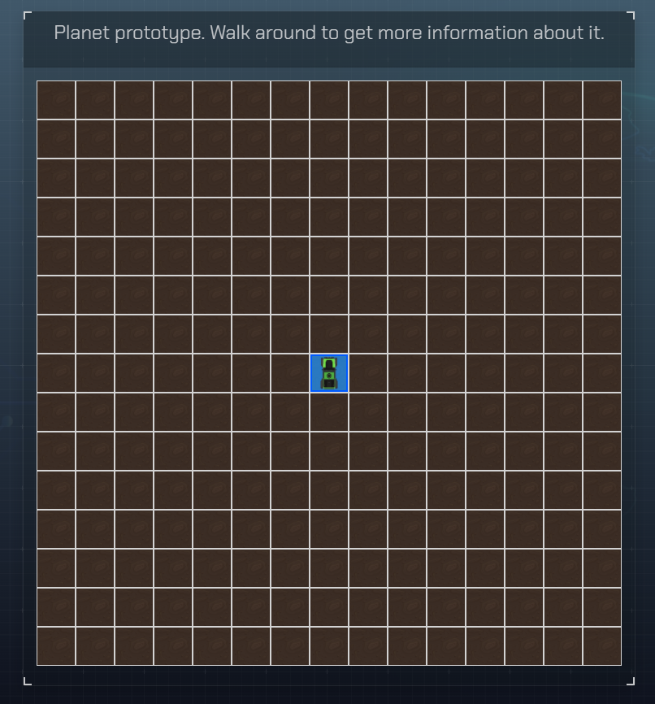
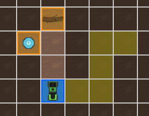

# 1. Presentación

Mi nombre es Genís y soy el desarrollador de la aplicación de Remote Control Rover. El proyecto se basa en una simulación donde el usuario puede controlar, remotamente y des del navegador, un vehículo de exploración enviado a cierto planeta. Mediante una serie de instrucciones es posible conducir el vehículo por la superfície del planeta y recibir información por allá donde circule. 

# 2. Funcionamiento de la aplicación
## 2.1. Pantalla Inicial
En este caso, para iniciar la aplicacion bastará con abrir el fichero "index.html" en el navegador. Esta vista se trata de una pantalla inicial mostrando el nombre de la aplicación y una breve presentación. Para iniciar una exploración basta con clicar sobre el botón "Launch" situado en el panel central.

## 2.2. Pantalla Mision
Al iniciar la exploración se accede a la pantalla de misión, la cual contiene disitintas secciones explicadas en los siguientes apartados.

### 2.2.1. Mapa
Lo primero que se encuentra en la parte central es una recreación del planeta donde se ha enviado el vehículo de exploración. Este mapa esta formado por distintas casillas que representan secciones reales del planeta y son las que permitiran realizar los movimientos del vehículo. 

Es posible darse cuenta que, inicialmente, hay una casilla distinta a las demás y que, además, coincide que es la del centro. Esta es la posición actual del vehículo y se caracteriza por tener su icono y el color azul.

El resto de casillas se ven todas iguales. Sin embargo, eso es porque aun no se explorado esa zona y, por lo tanto, no se dispone de información. Cuando se conduce el vehículo por una celda, esta se explora y muestra su contenido para ver si se ha topado con un obstáculo. 
Los obstáculos quedan representados con su icono y un color naranja. Hay distintos tipos de obstáculos.

Por último cabe destacar que al iniciar una misión el mapa se genera aleatoriamente, siempre añadiendo un total de 16 obstáculos por donde el vehículo no podrá circular.

### 2.2.2. Movimiento

El panel de movimiento se encuentra en la parte superior derecha y permite añadir una serie de instrucciones para que el vehículo realice el recorrido deseado por el terreno.

Usando los botones del joystick se pueden asignar movimientos para el vehículo. Para acomodar su manejo es importante saber que las direcciones de los botones hacen referencia a las coordenadas del mapa y no al vehículo. Es decir, la flecha superior moverá el vehículo hacia arriba siempre, independientemente hacia donde esté orientado el vehículo.
Al seleccionar una dirección, está quedará representada en una casilla de la secuencia y así sucesivamente. Como máximo se pueden añadir seis instrucciones por secuencia.
Al haber añadido las instrucciones de moviento se debe pulsar el botón de mover para llevarlo a cabo. Propiedades del movimiento:
- Una vez realizado el movimiento, el vehículo quedará desplazado a la casilla de destino en el mapa.
- Mientras se añaden instrucciones es importante el mapa ya que se iluminaran las casillas de destino.

- No se puede realizar una instrucción que marque como destino un obstáculo descubierto, una casilla por donde ya se pasa, la casilla del vehículo y los límites del mapa.
- Si el vehículo se encuentra con un obstáculo se dentendrá en la casilla previa y mandará información del obstáculo.

### 2.2.3. Obstáculos encontrados
El panel de obstáculos encontrados situado debajo del panel de movimiento informa del resultado recibido al realizar un movimiento.

Por lo tanto, si al realizar el movimiento no se encuentran obstáculos el panel mostrará una imagen del terreno sin mas. Sin embargo, si en el trancurso del movimiento se encuentra un obstáculo el panel se resaltará de un tono verdoso y enviará una imagen y el nombre del obstáculo. Dicho obstáculo quedará representado en el mapa con su icono y la celda naranja.

### 2.2.3. Relaunch
Debajo del panel de obstáculo se encuentra el botón de relanzar, para empezar una nueva misión con un nuevo planeta aleatorio.

# 3. Indicaciones técnicas
La aplicación ha sido desarrollada con los pilares de la tecnología web: HTML5, CSS3 y Javascript. El único recurso externo en este sentido es la libreria de Bootstrap en su versión 5.0.2, importada a través de su link para ahorrar espacio en el proyecto. En la parte de Javascript no se ha usado ninguna librería como jQuery ni ningún framework como Angular, Vue, React,..., por lo que se ha usado javascript puro, también conocido como Vanilla.
La raíz principal del proyecto se compone de lo siguiente:

## 3.1. HTML
Hay dos ficheros HTML, el index.html y en la carpeta de views > mission.html. Al no haber usado ningun sistema de inyección para las vistas, se ha aprovechado el index.html para realizar la portada y el mission.html para la vista de misión. 

## 3.2. CSS
Se han separado dos archivos CSS, uno para la portada incial y otro para la vista de misiones. Se encuentran en la carpeta de css.

## 3.3. Javascript
En la carpeta js se encuentra el fichero app.js que incluye el código javascript utilizado para este proyecto. Se han añadido comentarios en dicho fichero para explicar el código.

## 3.4. Imágenes
Las imágenes utilizadas como recursos gráficos en la aplicación son extráidas de internet con licencia libre.

